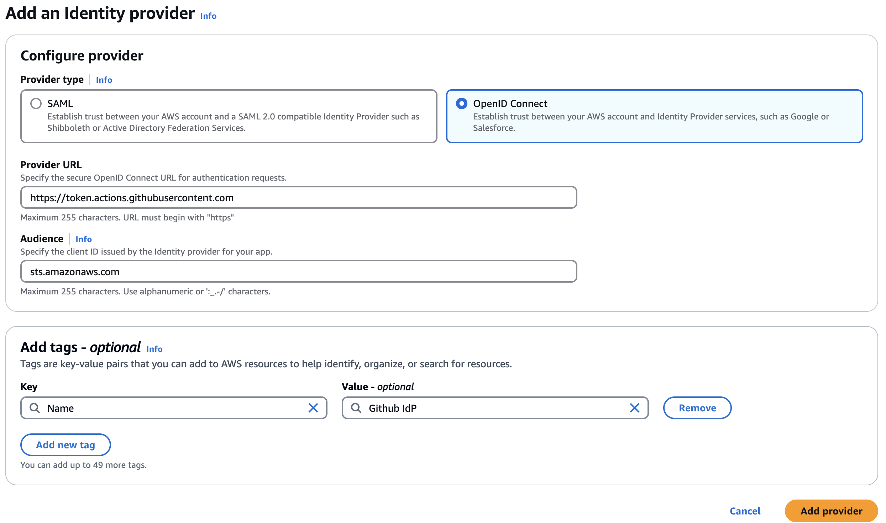

# Github CI Runner

This project uses Github Actions to run CI/CD pipelines. Since it is public, the cost
of running Github Actions is free.

## Challenges

### 1. Set up a self-hosted runner

Besides the free tier, Github Actions runners are actually quite expensive. The cost
of running a self-hosted runner is much cheaper.

Setting up self-hosted runners is already documented in the [official Github documentation](https://docs.github.com/en/actions/hosting-your-own-runners/adding-self-hosted-runners).

In summary, you need to:

1.  Go to your repository settings
2.  Go to the Actions tab
3.  Click on "New self-hosted runner"
4.  Follow the instructions and copy the script and token to connect the runner to your repository

Another options that I found is [RunsOn](https://runs-on.com).
It is a self-hosted runner that is very simple to switch from the free tier to a self-hosted runner.
You just need to replace:

```yaml
runs-on: ubuntu-latest
```

with:

```yaml
runs-on: [runs-on=${{ github.run_id }}, runner=whatever-you-need }}]
```

I ended up using RunsOn because it is simpler and use AWS so I can deploy my application to AWS as well. It is also free for non-commercial use and the runner will also automatically shut down when not in use.

### 2. Connect workflows with AWS

When running CI/CD pipelines, you will need to connect to AWS to deploy your application.
This can be done by setting up AWS credentials in the Github repository secrets.
There are many options provided by the runner @aws-actions/configure-aws-credentials, but
the most secure way is via [Github OIDC Provider](https://docs.github.com/en/actions/security-for-github-actions/security-hardening-your-deployments/configuring-openid-connect-in-amazon-web-services).

In summary, you need to:

1. Set up an OIDC provider in AWS

- Add Github as an identity provider by going to the IAM console
- Select "Identity providers" on the left sidebar and click on "Add provider"
- Select OpenID Connect and add the Github URL similar like this:
  
- Details include:

* Provider URL: `https://token.actions.githubusercontent.com`
* Audience: `sts.amazonaws.com`
* Ignore the tags as I only put them there for show

2. Set up a role in AWS
   During the setup of the new role (Let's say `GithubActionSSTDeploy` is the name), you will be prompted to select the trusted entity type.

- Select "Web identity" and select `token.actions.githubusercontent.com` as the identity provider.
- Select `sts.amazonaws.com` as the audience
- For this repository, I selected `coffeewithegg` as the Github organization and Github repository.
  This will help you set up the policy for the role.

Next, you will be prompted to set up the permissions for the role.
Depending on the task needed, you can set up a role with the necessary permissions.
For this case, I set up a role with the following permissions:

- `IAMFullAccess`
- `AWSLambda_FullAccess`
- `AmazonS3FullAccess`
- `AmazonDynamoDBFullAccess`
- `CloudFrontFullAccess`
- `AmazonRoute53FullAccess`

3. Update the workflow file
   One of the thing that is not typical in other setup is that you have to add permissions to the workflow file.
   This is because the runner is not running in AWS, so it does not have the permissions to assume the role.
   You can add the following step to the workflow file:

```yaml
permissions:
  id-token: write # This is used to allow Github OIDC provider to create a JWT token
  contents: read # This is to checkouts the repository
```

4. So this is where I currently stucked. I am able to assume role but when `sst deploy` is run, it is throwing an error.

```bash
aws: failed to refresh cached credentials, no EC2 IMDS role found, operation error ec2imds: GetMetadata, failed to get API token, operation error ec2imds: getToken, http response error StatusCode: 400, request to EC2 IMDS failed
```

It means that the runner failed to get the credentials from the EC2 IMDS role.

I am still trying to figure out how to solve this issue. But for now, I am switching to use `AWS_ACCESS_KEY_ID` and `AWS_SECRET_ACCESS_KEY` to deploy the application. 3. Debugging the CI/CD pipeline

When setting up CI/CD pipelines, I found it difficult to debug the pipeline when it fails. So these 2 lines helped me save the day:

```yaml
- name: Setup tmate session
  uses: mxschmitt/action-tmate@v3
```

This will set up a tmate session that you can connect to and debug the pipeline. Think of it as a breakpoint in your code. After that, rerun the pipeline and check the logs for the tmate session link.
